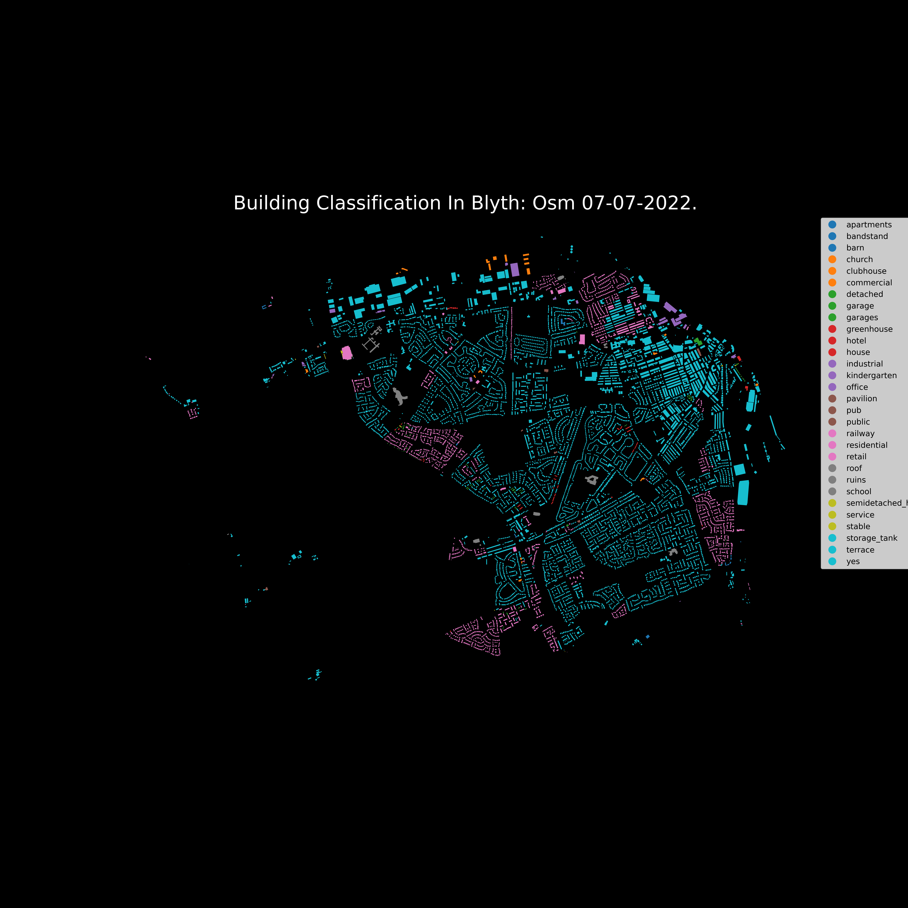
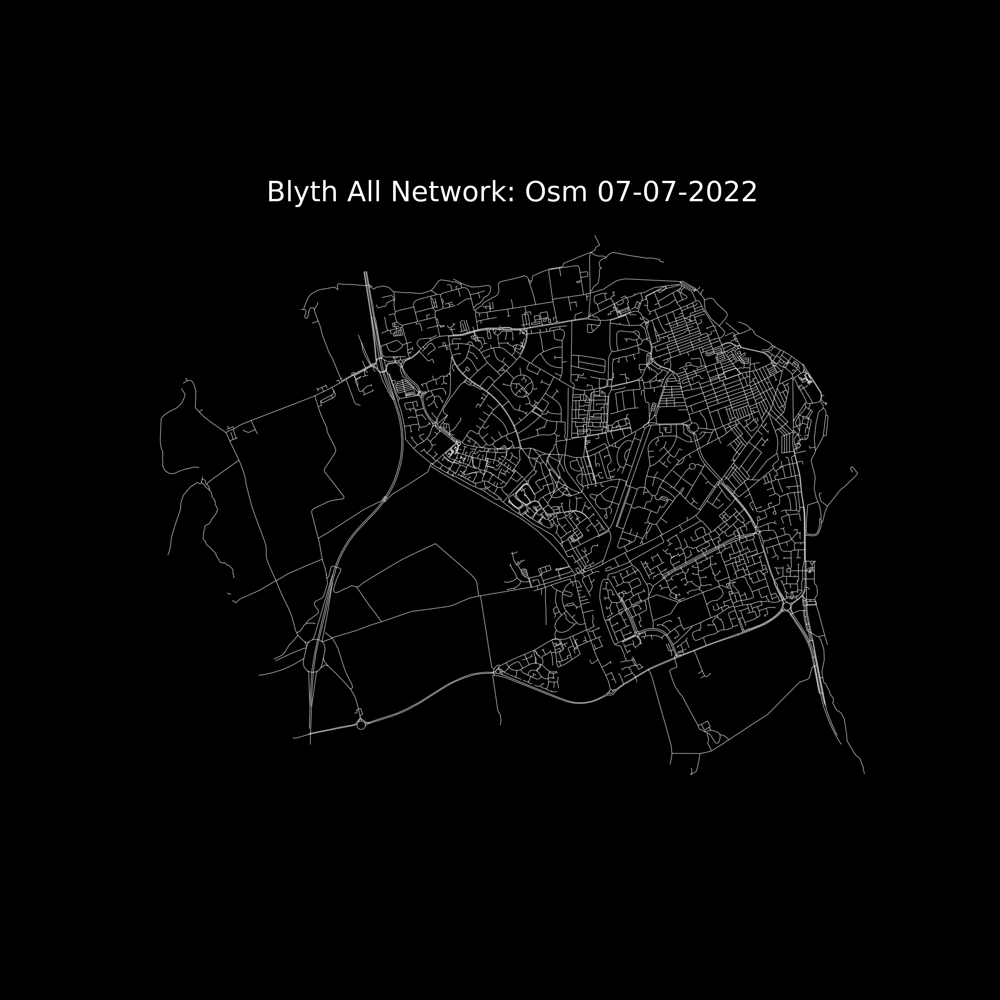

# pyrosm-experiments
Playground for working with Open Street Map data using the pyrosm library.

The above visuals were generated from open street map data using [the python pyrosm library](https://pyrosm.readthedocs.io/en/latest/).

## Outputs

All outputs within the output folder are currently gitignored, unless the
regexp pattern 'example' is found in the filename. Examples are used for
displaying in the readme.

## Data

Contents of the data folder and subdirectories are all gitignored. Suggest
as a good location for various osm.pbf files.
